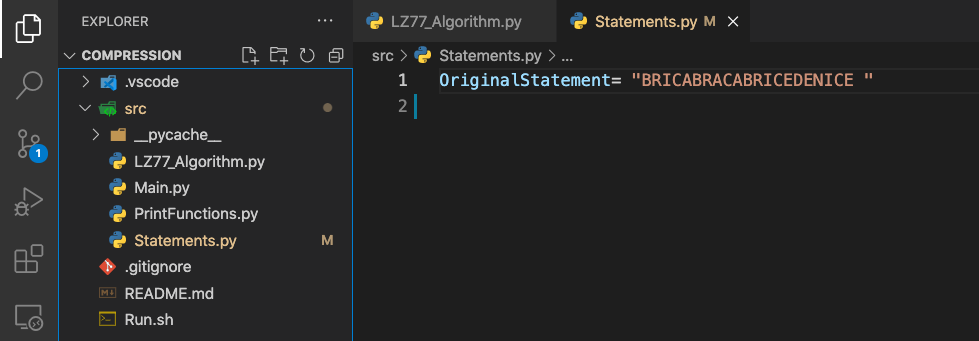

# TextCompression
Implementation of the LZ77 compression algorithm -- academic project

# how to use it

Clone it 
```
git clone https://github.com/Moha-boukhatem/LZ77_Algorithm.git
```

Execute the command line in your terminal 

```
./Run.sh
```
You can test it with your own Message Just change it in Statements.py file 
  
